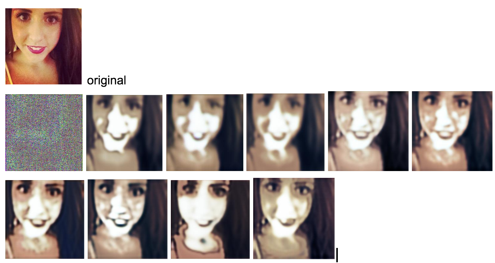
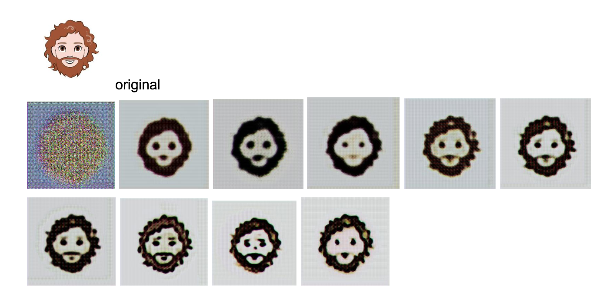

# CycleGAN

## Intro
Image-to-image translation is a fun topic. Classic examples are like turning an image of a horse to an image of a zebra. More useful example can be turning a black-and-white image to a colored image.

Good thing is that, for people to experiment with image-to-image translation, there're many libraries or code bases in which people implement classic models and everyone can use those to experiment.

## Pix2pix
The first classic image-to-image library is pix2pix. I tried this git repo (https://github.com/junyanz/pytorch-CycleGAN-and-pix2pix) because it's implemented by the original author of Image-to-Image Translation with Conditional Adversarial Networks and CycleGAN.

pix2pix requires paired images for training. The dataset they provide are like Yosemite summer to winter, facade map to real facade image. You can also try to make your own dataset by following [instructions](https://github.com/junyanz/pytorch-CycleGAN-and-pix2pix/blob/master/docs/datasets.md). You just need to provide 2 folders, and images with the same in 2 folders will be paired by the script. pix2pix is not crazy slow. 400 facade image pairs can generate reasonable results within a few hours (with a local Mac laptop).

## CycleGAN
However, in reality, paired image dataset is not very easy to find. That's where CycleGAN came from. CycleGAN can do image-to-image translation provided 2 unordered sets of images to train. For example, one folder can purely contain horse images, and the other folder can purely contain zebra images. After training, CycleGAN can change a horse to zebra in the image (while keeping all other things roughly the same).

I was really interested in trying how good CycleGAN translate. I started with this [codebase](https://github.com/junyanz/pytorch-CycleGAN-and-pix2pix/blob/master/docs/datasets.md) mentioned above. However, the visualization tool doesn't show any visualization even after 2 or 3 hours (versus pix2pix started showing somehting within minutes).

Then I thought, perhpas the model implemented by tensorflow could be faster.

After trying out few libraries, I ended up with [this one](https://github.com/architrathore/CycleGAN), because it's easy to understand and easy to change the code. For dataset, I wanted to do a selfie to cartoon translation.

I downloaded selfies from [here](http://crcv.ucf.edu/data/Selfie/).
I downloaded bitmoji like cartoon faces from [here](https://google.github.io/cartoonset/). These are used in Google Allo.

Then I changed the dataset paths to these 2 folders (I only used a few hundred from each data set, but even that turns out to be huge amount of work for training...).

There were some minor glitches in the codebase at the beginning. 
1. I needed to change this line "init = tf.global_variables_initializer()" to "init=(tf.global_variables_initializer(),tf.local_variables_initializer())".

2. There's one line "image_tensor.size() == img_size*batch_size*img_layer". Took me a while for me to figure out that size is an attribute of numpy array, not a function. So changing "image_tensor.size()" to "image_tensor.size" fixed the problem.

3. The cartoon images were in png. I changed the code from decode_jped to decode_png but didn't seem to work. So converted all png to jpeg with Preview.

Then finally it started running on my local laptop. And this time I see intermediate fake images generated. 

Bad news is that, after about 1.5 days of training, it still only finished 10 epoches with 100 images (the code had 100 max epoches), so it's only 10% done after 1.5 days. The next step should be to have it running on some Cloud service like Google Cloud or AWS. Preferbaly running on Google Cloud with TPU support. Perhaps that can turn days of work to hours.

Running the model training code on Cloud will be the next thing to try.

But we can take a look how the fake images generated have involved in the first 10 epoches by the following image.

